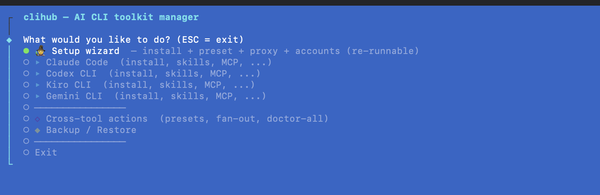
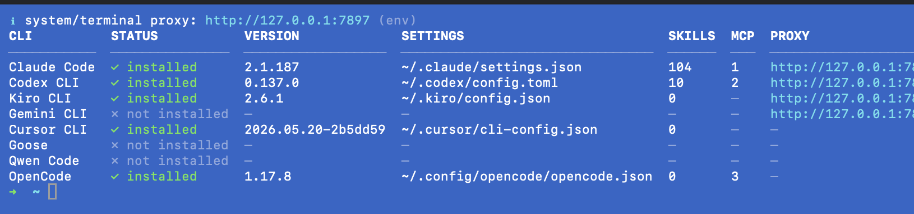
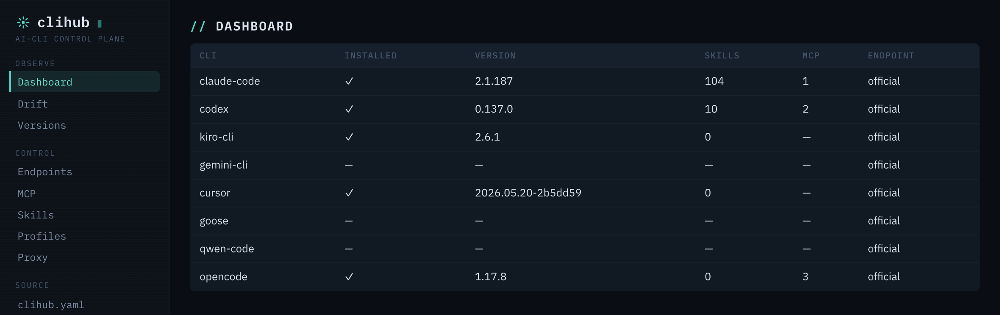
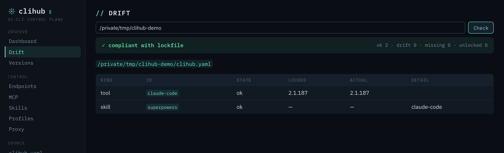
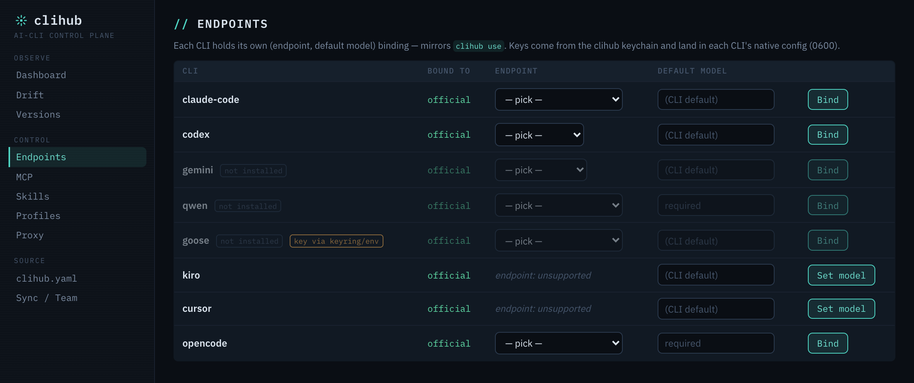
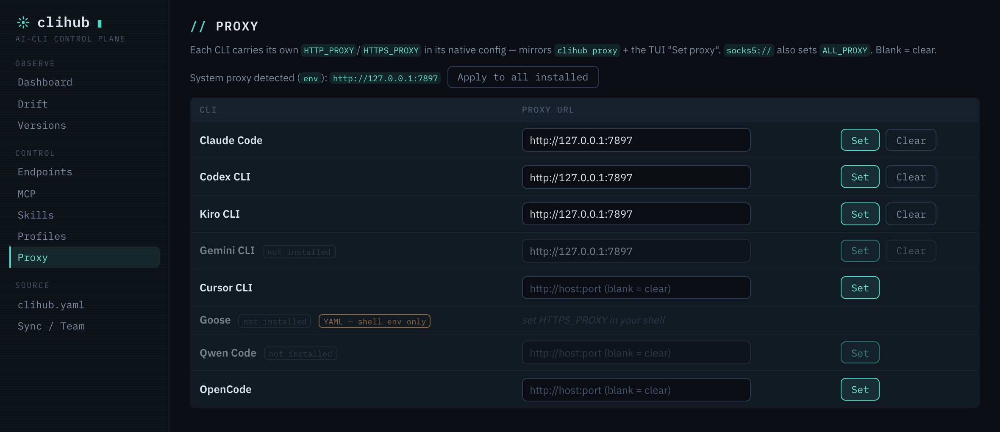

<p align="center"></p>

# clihub

[](https://www.npmjs.com/package/@wikieden/clihub)
[](https://www.npmjs.com/package/@wikieden/clihub)
[](LICENSE)
[](https://nodejs.org)

[English](README.md) | **简体中文**

**AI 编码 CLI 的可复现控制平面。** 一个工具装好 Claude Code、Codex、Gemini CLI、Qwen Code、Kiro、Cursor、Goose、OpenCode —— 把它们的 skills / MCP / 记忆 / 系统提示跨 CLI 同步，逐 CLI 切换账号 · 端点 · 代理，并把整套栈钉到已签名的 `clihub.lock.json`，升级出问题时一条命令回滚。可用**终端 TUI**、可脚本化的 **CLI**、或原生**桌面 GUI** 三种方式驱动 —— 共用同一内核。

<table>
  <tr>
    <td width="50%"></td>
    <td width="50%"></td>
  </tr>
  <tr>
    <td align="center"><b>桌面 GUI</b> —— Tauri 2 + Svelte 5</td>
    <td align="center"><b>终端 TUI</b> —— <code>clihub</code></td>
  </tr>
</table>

```bash
curl -fsSL https://raw.githubusercontent.com/wikieden/clihub/main/scripts/install.sh | sh
clihub preset apply starter
```

完事。多个 CLI 装好，核心 skill 同时铺到每个 CLI，旧的 `~/.claude` 已快照、可恢复。

> **谁适合用？** 小白、个人开发者、团队/企业各取一块价值 —— 见 [`docs/21-VALUE.md`](docs/21-VALUE.md)。

---

## 为什么用 clihub

每个 AI 编码 CLI 都有自己一套 skill / plugin / MCP 目录结构。同时用多个就会陷入：

- 同一个 skill 在四个目录里装四遍。
- 手动把 `superpowers` 同步到八套不同目录 —— `~/.claude/skills/`、`~/.codex/skills/`、`~/.gemini/commands/*.toml`、`~/.qwen/commands/*.toml`、`~/.kiro/steering/`、`~/.cursor/commands/*.md`、`~/.config/goose/recipes/*.yaml`、`~/.config/opencode/skills/`。
- 一次无关升级把配置冲掉，无法回退。

clihub 一次解决：

| | clihub | claude-skills | multica | ccpi | oh-my-claudecode |
| --- | --- | --- | --- | --- | --- |
| 安装 CLI 本体 | ✅ | ❌ | ❌ | ❌ | ❌ |
| 跨 CLI 的 skill 铺设（8 个 CLI） | ✅ | ✅ | 部分 | ❌（仅 CC） | ❌ |
| 预设打包 tools + skills + MCP | ✅ | ❌ | ❌ | ❌ | ❌ |
| 备份 / 一键回滚 `~/.claude` 及同类 | ✅ | ❌ | ❌ | ❌ | ❌ |
| 按工具版本锁定 + 回滚 | ✅ | ❌ | ❌ | ❌ | ❌ |
| 多账号 profile 切换 | ✅ | ❌ | ❌ | ❌ | ❌ |
| 逐 CLI 端点 + 模型绑定 | ✅ | ❌ | ❌ | ❌ | ❌ |
| 逐 CLI + GUI 代理管理 | ✅ | ❌ | ❌ | ❌ | ❌ |
| 多源目录联邦 | ✅ | ❌ | ❌ | ❌ | ❌ |
| Skill 安全审计 | ✅ | ❌ | ❌ | ❌ | ❌ |
| 单一记忆 / 系统提示源 → 每个 CLI | ✅ | ❌ | ❌ | ❌ | ❌ |
| 跨机器端到端加密同步 | ✅ | ❌ | ❌ | ❌ | ❌ |
| 签名目录（ed25519 供应链信任） | ✅ | ❌ | ❌ | ❌ | ❌ |
| 用 JSON spec 接入新 CLI（免 fork） | ✅ | ❌ | ❌ | ❌ | ❌ |
| 锁文件合规 / CI 漂移闸门 | ✅ | ❌ | ❌ | ❌ | ❌ |
| 终端 TUI **+ 原生桌面 GUI** | ✅ | ❌ | 部分 | ❌ | ❌ |
| 分发方式 | npm | shell | npm | npm | CC 插件 |

## 安装

```bash
# 一行命令（npm 包不可用时自动回退到 git clone + 构建）
curl -fsSL https://raw.githubusercontent.com/wikieden/clihub/main/scripts/install.sh | sh

# 或直接安装
npm install -g @wikieden/clihub
bun add -g @wikieden/clihub
```

也可用容器运行，无需本地安装：

```bash
docker run --rm -it -v ~/.claude:/root/.claude wikieden/clihub
docker run --rm -it wikieden/clihub doctor
```

**桌面应用：** 从 [Releases](https://github.com/wikieden/clihub/releases) 下载未签名的 macOS / Windows / Linux 构建（tag `desktop-v*`）。内置独立 daemon —— 无需 bun 或仓库源码。代码签名 / 公证待办，首次启动可能需在 Gatekeeper / SmartScreen 放行。

要求：Node ≥ 18（或 Bun）。支持 Linux / macOS / WSL。

## 快速上手

```bash
clihub wizard                          # 引导式首装（推荐）
clihub                                 # 交互式 TUI 主菜单

# 或脚本化：
clihub tool install claude-code
clihub tool install codex
clihub skill install superpowers       # 自动铺到每个已装的 CLI
clihub preset apply fullstack          # tools + skills + MCP 套装
clihub doctor                          # 跨 CLI 健康检查
clihub backup                          # 高风险升级前快照 ~/.claude
clihub rollback                        # 恢复最近一次快照
```

## clihub 的三+1 种形态

四者共用同一个 `@clihub/core` 内核 —— **golden 一致性**：一个 GUI 面板、一条 CLI 命令、一次直接内核调用返回完全相同的结果，绝不分叉逻辑。

1. **CLI** —— `clihub <子命令>`，headless/CI 友好。可脚本化的一面。
2. **终端 TUI** —— 裸跑 `clihub` 打开交互菜单（`@clack/prompts`）。引导的一面。
3. **桌面 GUI** —— 原生 Tauri 2 + Svelte 5 应用（10 个面板）。拉起回环 `@clihub/daemon` sidecar，每个面板绑定同样的内核函数。可视的一面。
4. **Claude Code skill** —— 装在 `~/.claude/skills/clihub/`；Claude Code 里 `/clihub` 打开菜单，模型代你执行操作。智能体内的一面。

## 实操演示

### 终端 TUI

不带参数跑 `clihub` 进交互菜单 —— 装 CLI、铺 skill、逐 CLI 设代理或端点，全程引导。`clihub doctor` 则一屏给出跨 CLI 健康矩阵：安装状态、版本、原生配置路径、skills/MCP 数、以及每个 CLI 的当前代理。



### 桌面 GUI

桌面应用以护城河打头 —— 健康、漂移、锁文件合规 —— 而非 provider 下拉。10 个面板，4 套主题。

**Dashboard** —— 一眼看跨 CLI 健康 + 版本矩阵：



**Drift** —— 本机是否仍匹配已签名的 `clihub.lock.json`？（ok / drift / missing）：



**Endpoints** —— 把每个 CLI 绑到 LLM 端点 + 默认模型；key 取自 keychain 并落进各 CLI 原生配置（0600）：



**Proxy** —— 设每个 CLI 的 `HTTP(S)_PROXY`（或把探测到的系统代理一键应用到全部）—— 与 `clihub proxy` 同一动作，搬进 GUI：



## 当前支持

**CLI**（8 个）：Claude Code、OpenAI Codex CLI、Gemini CLI、Qwen Code、Kiro CLI、Cursor CLI、Block Goose、OpenCode。

**驱动方式**：可脚本化 **CLI**、交互 **TUI**、原生**桌面 GUI**（10 面板：Dashboard · Drift · Endpoints · MCP · Skills · Profiles · Proxy · Versions · clihub.yaml · Sync/Team）、以及 **Claude Code skill**（`/clihub`）。全部经回环 `@clihub/daemon` 走同一 `@clihub/core` 内核。

**Skills**：目录内 30 个 —— `superpowers`、`oh-my-claudecode`、`codegraph`、`tdd`、`review`、`frontend-design`、`api-design`、`database-migrations`、`caveman`、`lark-im`、`lark-doc`、`lark-wiki` …（[完整列表](packages/catalog/skills.json)）。

**MCP servers**：14 个 —— `filesystem`、`github`、`gitlab`、`postgres`、`sqlite`、`git`、`slack`、`brave-search`、`fetch`、`playwright`、`memory`、`sequential-thinking`、`context7`、`deepwiki`（[完整列表](packages/catalog/mcp.json)）。

**预设**（8）：
- `starter` —— Claude Code + 5 个核心 skill（1 分钟搭好）。
- `fullstack` —— 全栈 skill（前端、后端、数据库、review、安全、git）。
- `python` / `go` / `rust` —— 语言开发套装（review、tdd、安全）。
- `research` —— 网络搜索 + 综合 + 规划 + 文档。
- `devops` —— 部署、安全、性能、git。
- `lark-office` —— 飞书 / Lark 协作套件。

**配置管理**（CLI + GUI，逐 CLI）：版本锁定/回滚 · `~/.claude` 备份/回滚 · 多账号 profile + keychain · 端点 + 模型绑定 · 代理 + CA bundle · MCP servers · skills · 系统提示 + 记忆铺设。

**可复现**：`clihub.yaml` → 已签名 `clihub.lock.json` → `status --strict` CI 漂移闸门 · `clihub diff` · `clihub ci`（GitHub/GitLab）· `clihub team`（git 共享配置）· 跨机器端到端加密 `sync`。

**语言**：English、简体中文、日本語、한국어、Español（按 `$LANG` 自动检测，可用 `CLIHUB_LANG` 覆盖）。

## 命令一览

完整命令见英文版 [README](README.md#commands) 与 [`docs/02-CLI-COMMANDS.md`](docs/02-CLI-COMMANDS.md)。常用：

```
clihub                              TUI 主菜单
clihub wizard [--dry-run]           引导式首装：CLI + 预设 + 代理 + 账号 + 配置
clihub tool install <id>[@version]  锁定具体版本
clihub tool rollback <id>           回滚到上一个已装版本
clihub skill install <id|git-url|path> [--tool <cli>]
clihub skill audit [id] [--json]    标记 shell/hooks/网络/符号链接风险
clihub preset apply <id>
clihub doctor [id] [--fix]          跨 CLI 健康检查 + 自动修复
clihub use <endpoint> [--for <cli>] [--model <m>]   逐 CLI 绑定端点 + 默认模型
clihub model <cli> <model>          仅设某 CLI 的默认模型（kiro/cursor 路径）
clihub proxy <set|unset|show|test> [--tool <id>]    HTTP/HTTPS/SOCKS5 + CA bundle
clihub apply [--plan]               把本机收敛到 clihub.yaml
clihub lock                         把解析后的版本钉到 clihub.lock.json
clihub status [--json] [--strict]   对照 clihub.lock.json 检查本机（CI 闸门）
clihub memory generate              单一记忆源 → 每个 CLI 的记忆文件
clihub prompt <set|show|sync>       单一系统提示 → 每个 CLI（托管块）
clihub sync export | import         端到端加密的配置包，跨机器搬运
clihub team <add|pull|use|push>     用一个 git 仓库在团队间共享配置
clihub daemon <start|stop|status>   回环 GUI sidecar（bearer token 存 ~/.clihub/daemon.json, 0600）
clihub provider add <spec.json>     用 JSON spec 接入新 CLI —— 免 fork
```

## 设计理念

- **厂商中立** —— 永不偏袒某一个 CLI（即便 Claude Code 是主力场景）。
- **开放标准优先** —— agentskills.io SKILL.md、MCP、相关 OCI 镜像。
- **默认零遥测** —— 仅在显式 opt-in 后采集聚合计数。
- **回滚神圣** —— 每次写入前先做带时间戳的备份，绝不丢用户状态。
- **不分叉逻辑** —— 每个界面动作都映射到一个 `@clihub/core` 函数；golden 测试证明 GUI == CLI == 内核。
- **持钥匙的东西默认关闭、独立包** —— 可选的本地网关（若启用）是独立的 `@clihub/gateway`，默认不装。

## 路线图

- **v0.1–v1.50** ✅ —— providers + 30 skills + 预设 + 跨工具铺设 + i18n + per-CLI TUI + MCP 目录；多账号 profile + keychain；版本锁定/回滚；skill 审计；目录联邦；签名目录；声明式 provider SDK；`status` 漂移闸门 + `schema`；**稳定** 冻结面（`clihub.yaml` v1 · `clihub.lock.json` v1 · `@clihub/core` API）；`ci` · `team` · `auth login`（设备码 / PKCE / 刷新）· `conformance` · `recommend` · `diff` · 统一 `mcp` · 首装 **wizard** · 逐 CLI 代理注入。覆盖到 **7 个 CLI**。
- **v1.55–v1.60** ✅ —— `prompt`（系统提示铺设）· `usage`（token 汇总，仅 token）· 云文件夹同步 + `sync --watch` 脱敏守卫 · `self-update` · 锁文件 provider + 系统提示哈希进 `status --strict`。
- **v1.61–v1.65** ✅ —— **`@clihub/daemon`** 回环 sidecar · **Tauri 2 + Svelte 5 桌面 GUI** · **逐 CLI provider 绑定**（`clihub use` —— catalog v2 多协议 `urls`、claude/codex/gemini/qwen/goose 适配器、kiro/cursor 仅模型、锁文件 `bindings` + `status --strict` 闸门）· GUI 重设计（多主题控制平面）· **OpenCode** 成为 **第 8 个 CLI**。
- **v1.66–v1.68** ✅ —— OpenCode 对齐（catalog MCP + usage）· 桌面发版流水线（`tauri-action`，macOS 通用 / Windows / Linux，未签名）· 打包崩溃修复（运行时解析 daemon）· **bun-less 编译 daemon sidecar**（用户机无需 bun 或仓库源码）。
- **next** —— **GUI 代理**（CLI ↔ GUI 对齐，已落 `main`）· macOS 公证 / Windows 代码签名（待预算）· 可选、默认关闭的**本地网关**，受 adoption + 预算 review 门禁（仅设计 —— 见 [`docs/26-GATEWAY-DESIGN.md`](docs/26-GATEWAY-DESIGN.md)）。

完整历史见 [`CHANGELOG.md`](CHANGELOG.md)、[`docs/24-VERSION-PLAN.md`](docs/24-VERSION-PLAN.md) 与 [`docs/23-ARCHITECTURE.md`](docs/23-ARCHITECTURE.md)。

## 许可证

MIT。
